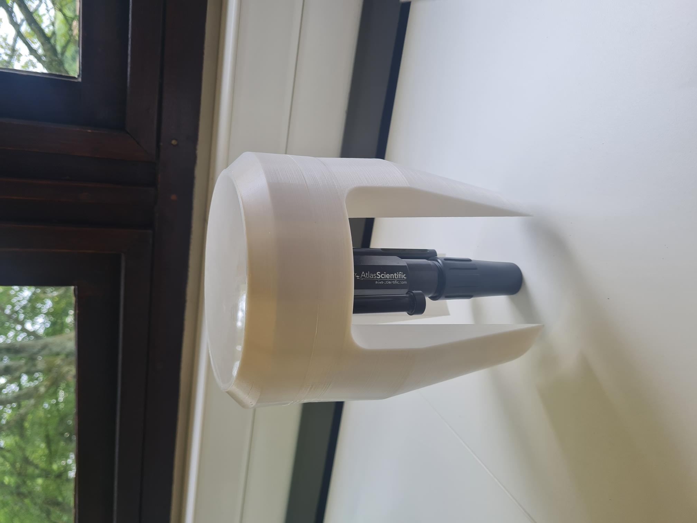

# Home

Welcome to the SmartWater sensor documentation page. Here, you'll find all the information you need to get on to work with the sensor. If you are going to use the preconfigured sensors you receive for testing, you can follow the instructions in the [Quickstart](./user-guide/quick-start.md). For advanced deployments, see the [advanced setup](./user-guide/advanced-setup/self-hosted-deployment.md) section that goes into details on how to make a sensor deployment from scratch.

{ width="400", align=right}

## Introduction to SmartWater project

Making smart decisions protecting our precious water resources requires loads of data and accurate models. Water quality, which is one of the factors limiting access to fresh water the most has been incredible hard to model. We use global satellite imagery datasets to derive proxy indices of surface water quality, and feed those data into our models to make better preditions. However, groundtruthing, needed in order to ensure accurate model calibration, is impossible to do with traditional methods. Smart water sensor aims to fill the data gap. It's a low-cost autonomus sensor that collects basic water quality parameters like pH, electrical conductivity, dissolved oxygen and temperature and sends it over LoRa network to remote servers.
