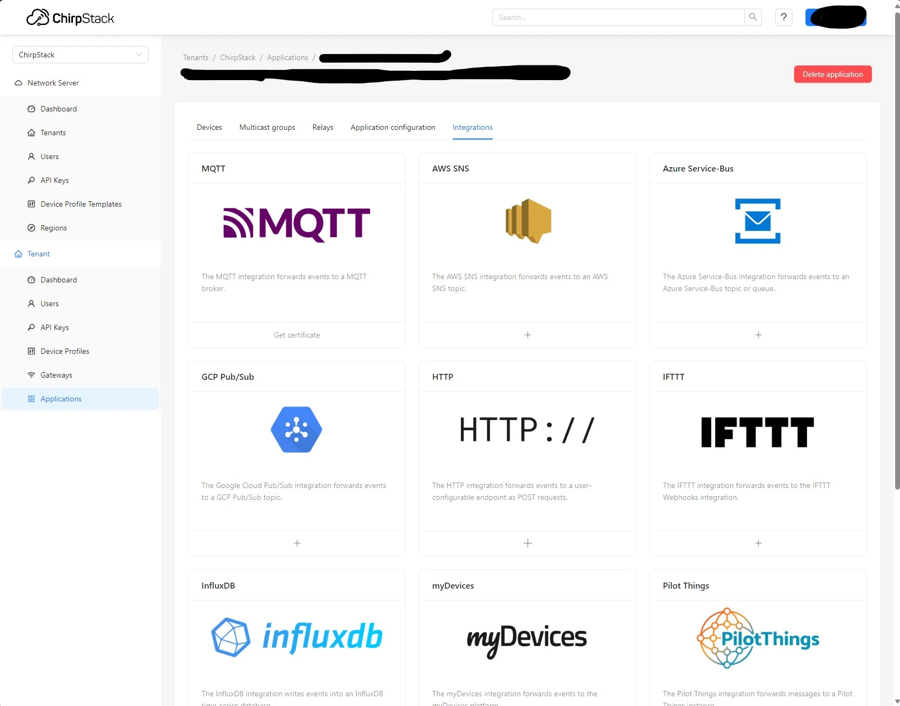

# Self hosted deployment

Here we will provide some useful tips on how to deploy one of the SmartWater sensors on your own, from scratch, making you the 'producer' and host of the data. Some essential components of the system you need to create will be:

- a web server,
- stack of software deployed on that webserver to receive and process the data
- communication devices deployed at the measurement site
- SmartWater sensor with customized firmware

!!! tip

    Alternatively, you can use existing technologies like [TheThingsNetwork](https://www.thethingsnetwork.org/). They have a reasonable free plan and paid plans if those better suit yout needs.

## Web server

You need a place on the web where all the data collected by the sensors will be channeled. Nowadays, deploying a web server is fairly straight forward. You first need to choose your provider. Some of the popular ones are [AWS](https://aws.amazon.com/), [Azure](https://azure.microsoft.com/), [DigitalOcean](https://www.digitalocean.com/) and [Linode](https://www.linode.com/). Before deployment, you need to decide how big your application can get and choose appropriate infrastructure. Take into account what software stack you want to use (the next section).

## Software stack

When you already have a web server, it's time to install your software stack. In SmartWater project we use an Chirpstack, open-source LoRaWAN network server. Probably the easiest way to set up chirpstack on your server is to use docker and docker-compose. It gives you plenty of room for customization and reproducibility. Check out [this](https://www.chirpstack.io/docs/getting-started/docker.html) guide to learn how to set up chirpstack using docker compose. To customize the installation, you can create your own docker-compose.yaml file.

Great. Now you have a platform with a powerful web interface where you can manage gateways, devices and tenants. The next step is to set up data integration. Depending on your goal and what kind of technologies you are familiar with, you have to choose how you would like to permanently store and distribute the data you collect. Chirpstack offers a range of integrations that can work "out of the box":

<figure markdown="span">
  { width="800" }
  <figcaption>Some of the integrations available in chirpstack</figcaption>
</figure>
